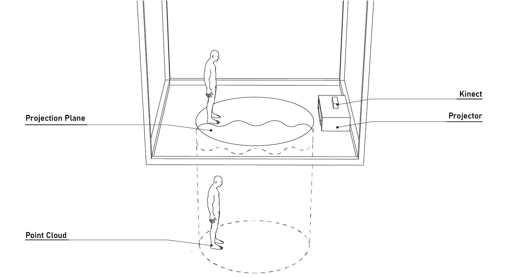

# 공간#2 | Space#2
##### 임의존재 작 | made by random-entity

---

## 개요 | Summary
공간의 구조를 재구성하려는 시도의 작업이다. 

땅 속으로 우물이 파여 있고, 물이 차 있다. 
관람자는 땅 속의 우물을 본다. 그 속에는 땅 위와 똑같은 공간이 보인다. 
관람자의 움직임에 상응하여 수면에 파동이 생긴다. 
그 파동에 상응하여 물 속의 사물들은 굴절에 의해 왜곡되어 보인다. 
관람자가 움직이지 않고 있으면 파동은 잦아든다. 
멈춰 섰을 때 비로소 자기 자신이 똑바로 보인다. 
 
물론 실제로 땅 밑에 우물이 파여 있는 것이 아니다. 
3차원인 것처럼 착시를 불러일으키는 2차원 프로젝션 매핑을 활용한다. 
이런 기술을 부르는 명칭에 대해 "off-axis projection"이라는 말을 많이 쓰는 것으로 보이지만, 일반적인 동의도 아닌 것 같으므로 본 문서에서는 간지 나는 단어를 써서 대략 "parallax projection"이라고 부르겠다. 

---

## 동기 | Motivation

2019년 말에 원시적인 프로토타입을 만든 이래 2021년 졸업전시 미디어디자인프로젝트에서 정교화/세련화해서 전시하려고 생각해 왔던 작업('인간의 숲')이 있었다. <s>언젠가 꼭 완성하고 싶은 작업이다</s> 
그러나 2021년 3월에 집이 생겨서 들뜬 것도 있었고, 노는 게 너무 좋아서 1학기 내내 별 작업 안 한 채로 있다가 여름방학도 지나갔고 가을도 가고 있었다. 
아무래도 시간 내에 못 할 것 같았다. 
그래서 미니멀하면서 감동을 줄 수 있는 것을 생각해보았다. 
'공간#1'이라고 부른, 하나의 작업을 시작해 보았다. 
그러나 기본적인 틀을 잡은 뒤부터는 잘 확장할 수 있는 여지가 보이지 않았다. 
그래서 다시 생각해 봤다. 
'공간#1' 때문에 어찌됐든 Unity Engine 상에서의 Shader 스크립팅에 대해 공부하고 있었다. 
여러가지 자료들을 보면서 어느 정도는 알게 됐다. 
어느 날 [Catlike Coding](https://catlikecoding.com/unity/tutorials/)을 보고 있었다. 
둘러보다가 [물 속을 보는 것처럼 하는 렌더링](https://catlikecoding.com/unity/tutorials/flow/looking-through-water/)에 대한 아티클을 읽었다. 
우물이 생각났다.
우물 모형을 전시장에 갖다놓고 사람들이 그 속을 들여다볼 수 있게 하면 어떨까 싶었다. 
그러면 우물 안에 뭐가 보이면 좋을까? 
필자는 재귀적 구조에 집착하는 사람이다. 

다음에 계속...
<!-- '시간#3'이라는 서울대학교 예술주간 아트스페이스 작업을 하기 위해 단초점 빔프로젝터를 지원금으로 샀다. -->

---

## 기술 | Techs
고민이 많았다. 
필자가 가지고 있는 shader에 대한 좁은 지식을 가지고 어떻게 parallax projection을 해결할까 아주 오래 고민하던 중 몹시 좌절한 상태로 구글링을 하다가 
[Michel de Brisis라는 분의 이 아티클](https://medium.com/@michel.brisis/off-axis-projection-in-unity-1572d826541e)을 찾았다. 
이 아티클이 참조한 [Robert Kooima라는 분의 다른 아티클](http://160592857366.free.fr/joe/ebooks/ShareData/Generalized%20Perspective%20Projection.pdf)도 찾게 되고, 
그 아티클을 참조한 [다른 아티클](https://en.wikibooks.org/wiki/Cg_Programming/Unity/Projection_for_Virtual_Reality)도 찾게 됐다.

다음에 계속...

<!-- [Catlike coding]()을 읽고 있었다. -->
<!-- 무라카미 하루키 소설에 자주, 그리고 윤동주의 시 '자화상'에 등장하는 우물 소재를 동기로 시작하게 되었다. 
공간의 구조를 왜곡하고 바닥에 3차원 착시를 일으키도록 영사하여 땅 밑에 우물이 있는 것처럼 볼 수 있도록 한 인터랙티브 설치입니다. 
거울과 비슷하지만 거울과 다르게, 공간 구조에 루프가 있는 것처럼 땅 위와 똑같은 공간이 평행이동되어 땅 밑 물이 찰랑거리는 우물 속에 보여진다면 보는 이에게 구체적으로는 모르겠지만 어떤 특별한 체험이 될 수 있다고 생각했습니다. 
리얼타임 머리 위치 및 깊이 공간 트래킹을 위해 Kinect v.2가 사용되었고, 렌더 카메라의 projection plane을 바닥으로 설정하고 수면에 파동을 일으키고 그에 따라 굴절 효과를 내고 현실 공간을 포인트 클라우드 형태로 렌더링하여 재현하는 데에는 Unity Engine을 활용했습니다. -->

---

## 전시 | Exhibition

2021년 서울대학교 디자인학부 졸업전시(SNU Design Week, 2021/12/09~16)에서 전시된다. 
온라인 전시에 대한 대책은 아직 없다. <s>영상만으로 떼우면 될까? 모바일/웹 환경을 위해 뭘 더 해볼까?</s>

---

## 스크립트들 | Scripts
- ### Parallax projection
  - #### ProjectionPlane.cs
  - #### ProjectionCamera.cs
  - #### ProjectionRenderTexturePlane.cs

- ### Water rendering
  - #### Water.shader
  - #### Waves.cginc
  - #### LookingThroughWater.cginc

- ### Wave Source
  - #### WaveSource.cs
  - #### WaveSourceManager.cs

- ### Getting Kinect data in Unity
  - #### Depth and color
    - #### MultiSourceManager.cs
  - #### Body track
    - #### 

- ### Point cloud rendering from Kinect data
  - 

- ### Meshes
  - ####

- ### Environment
  - #### 

## 기타 | Else
- ### Materials
- ### Models